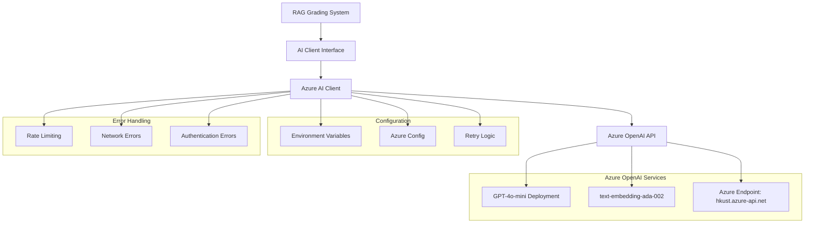

# Design Document

## Overview

This design document outlines the migration of the existing grading system to Azure OpenAI API integration. The migration will replace the current AI client implementation with a production-ready AzureAIClient that interfaces with Azure OpenAI services for both embeddings and essay grading. The design maintains full compatibility with existing interfaces while providing real AI-powered functionality through Azure's GPT-4o-mini and text-embedding-ada-002 models.

## Architecture

### High-Level Architecture



### Component Integration

The Azure AI Client will integrate seamlessly with the existing system architecture:

- **Interface Compatibility**: Implements the existing `AIClient` interface without breaking changes
- **Drop-in Replacement**: Can replace existing AI client in the system initialization
- **Configuration Management**: Uses environment variables and configuration objects for Azure settings
- **Error Handling**: Provides robust error handling with retry mechanisms and graceful degradation

## Components and Interfaces

### Azure AI Client Implementation

```python
class AzureAIClient(AIClient):
    """Azure OpenAI implementation of the AIClient interface."""
    
    def __init__(self, config: AzureOpenAIConfig):
        self.config = config
        self.chat_client = AzureChatOpenAI(
            azure_endpoint=config.endpoint,
            api_key=config.api_key,
            api_version=config.api_version,
            deployment_name=config.deployment_name,
            temperature=config.temperature
        )
        self.embedding_client = AzureOpenAIEmbeddings(
            azure_endpoint=config.endpoint,
            api_key=config.api_key,
            api_version=config.api_version,
            deployment_name=config.embedding_deployment_name
        )
        self.retry_config = RetryConfig()
```

### Configuration Management

```python
@dataclass
class AzureOpenAIConfig:
    """Configuration for Azure OpenAI integration."""
    endpoint: str = "https://hkust.azure-api.net"
    api_key: str = ""  # From environment variable
    api_version: str = "2024-10-21"
    deployment_name: str = "gpt-4o-mini"
    embedding_deployment_name: str = "text-embedding-ada-002"
    temperature: float = 0.0
    max_retries: int = 3
    timeout: int = 30
    
    @classmethod
    def from_environment(cls) -> 'AzureOpenAIConfig':
        """Create configuration from environment variables."""
        return cls(
            api_key=os.environ.get('OPENAI_API_KEY', ''),
            endpoint=os.environ.get('AZURE_OPENAI_ENDPOINT', cls.endpoint),
            api_version=os.environ.get('AZURE_OPENAI_API_VERSION', cls.api_version),
            deployment_name=os.environ.get('AZURE_OPENAI_DEPLOYMENT', cls.deployment_name),
            embedding_deployment_name=os.environ.get('AZURE_EMBEDDING_DEPLOYMENT', cls.embedding_deployment_name)
        )
```

### Retry and Error Handling Strategy

```python
@dataclass
class RetryConfig:
    """Configuration for retry logic."""
    max_retries: int = 3
    base_delay: float = 1.0
    max_delay: float = 60.0
    exponential_base: float = 2.0
    jitter: bool = True

class AzureAPIError(Exception):
    """Base exception for Azure API errors."""
    pass

class RateLimitError(AzureAPIError):
    """Raised when API rate limits are exceeded."""
    pass

class AuthenticationError(AzureAPIError):
    """Raised when API authentication fails."""
    pass

class NetworkError(AzureAPIError):
    """Raised when network issues occur."""
    pass
```

### Embedding Generation Implementation

```python
async def generate_embedding(self, text: str) -> List[float]:
    """Generate embedding using Azure OpenAI text-embedding-ada-002."""
    try:
        # Input validation
        if not text or not text.strip():
            raise ValueError("Text cannot be empty")
        
        # Truncate text if too long (Azure has token limits)
        text = self._truncate_text(text, max_tokens=8000)
        
        # Generate embedding with retry logic
        embedding = await self._retry_with_backoff(
            self._generate_embedding_internal,
            text
        )
        
        return embedding
        
    except Exception as e:
        logger.error(f"Failed to generate embedding: {e}")
        raise AIServiceError(f"Embedding generation failed: {str(e)}")

async def _generate_embedding_internal(self, text: str) -> List[float]:
    """Internal method for embedding generation."""
    response = await self.embedding_client.aembed_query(text)
    return response
```

### Essay Grading Implementation

```python
async def grade_essay(
    self,
    essay: str,
    context: str,
    criterion_name: str,
    criterion_id: str,
    max_score: float
) -> GradingCriterion:
    """Grade essay using Azure OpenAI GPT-4o-mini."""
    try:
        # Construct grading prompt
        prompt = self._build_grading_prompt(
            essay=essay,
            context=context,
            criterion_name=criterion_name,
            criterion_id=criterion_id,
            max_score=max_score
        )
        
        # Generate grading with structured output
        response = await self._retry_with_backoff(
            self._grade_essay_internal,
            prompt
        )
        
        # Parse and validate response
        grading_result = self._parse_grading_response(response, criterion_id, criterion_name, max_score)
        
        return grading_result
        
    except Exception as e:
        logger.error(f"Failed to grade essay for criterion {criterion_name}: {e}")
        raise AIServiceError(f"Essay grading failed: {str(e)}")

def _build_grading_prompt(self, essay: str, context: str, criterion_name: str, criterion_id: str, max_score: float) -> str:
    """Build the grading prompt for Azure OpenAI."""
    return f"""You are an expert AI teaching assistant. Your task is to grade a student's essay based on the provided rubric context.

**STUDENT ESSAY:**
{essay}

**RUBRIC CONTEXT:**
{context}

**GRADING INSTRUCTIONS:**
1. Carefully read the student's essay
2. Review the provided rubric context
3. Evaluate the essay specifically for the criterion: **{criterion_name}**
4. Assign a fair score between 0 and {max_score} (can be decimal like 8.5)
5. Provide detailed justification and constructive suggestions
6. Identify specific text excerpts that support your evaluation

**RESPONSE FORMAT:**
You must respond with a valid JSON object matching this exact schema:
{{
  "criterion_id": "{criterion_id}",
  "criterion_name": "{criterion_name}",
  "score": <number between 0 and {max_score}>,
  "max_score": {max_score},
  "justification": "<detailed explanation>",
  "suggestion_for_improvement": "<constructive feedback>",
  "highlighted_text": "<relevant essay excerpts>"
}}"""
```

### Connection Validation and Health Checks

```python
async def validate_connection(self) -> bool:
    """Validate Azure OpenAI connection."""
    try:
        # Test with a simple embedding request
        test_embedding = await self.generate_embedding("test connection")
        
        # Test with a simple chat completion
        test_messages = [{"role": "user", "content": "Hello, this is a connection test."}]
        test_response = await self.chat_client.achat(test_messages)
        
        return len(test_embedding) > 0 and test_response is not None
        
    except Exception as e:
        logger.warning(f"Azure OpenAI connection validation failed: {e}")
        return False

async def get_model_info(self) -> dict:
    """Get Azure OpenAI model information."""
    return {
        "model_name": self.config.deployment_name,
        "embedding_model": self.config.embedding_deployment_name,
        "endpoint": self.config.endpoint,
        "api_version": self.config.api_version,
        "temperature": self.config.temperature,
        "capabilities": ["text_generation", "embeddings", "structured_output"]
    }
```

## Data Models

### Azure-Specific Models

```python
@dataclass
class AzureAPIResponse:
    """Wrapper for Azure API responses."""
    content: str
    usage: dict
    model: str
    finish_reason: str
    
@dataclass
class EmbeddingResponse:
    """Response from Azure embedding API."""
    embedding: List[float]
    usage: dict
    model: str

@dataclass
class GradingResponse:
    """Structured response from Azure grading API."""
    criterion_id: str
    criterion_name: str
    score: float
    max_score: float
    justification: str
    suggestion_for_improvement: str
    highlighted_text: Optional[str]
```

### Error Response Models

```python
@dataclass
class AzureErrorResponse:
    """Azure API error response structure."""
    error_type: str
    error_code: str
    message: str
    details: Optional[dict] = None
    retry_after: Optional[int] = None  # For rate limiting
```

## Error Handling

### Comprehensive Error Handling Strategy

The Azure AI Client implements a multi-layered error handling approach:

1. **Input Validation**: Validate all inputs before making API calls
2. **Retry Logic**: Implement exponential backoff for transient failures
3. **Rate Limiting**: Handle Azure API rate limits gracefully
4. **Authentication**: Provide clear error messages for auth failures
5. **Network Issues**: Handle timeouts and connection errors
6. **Response Validation**: Validate API responses before processing

### Retry Implementation

```python
async def _retry_with_backoff(self, func, *args, **kwargs):
    """Implement exponential backoff retry logic."""
    last_exception = None
    
    for attempt in range(self.retry_config.max_retries + 1):
        try:
            return await func(*args, **kwargs)
            
        except RateLimitError as e:
            if attempt == self.retry_config.max_retries:
                raise e
            
            # Use retry-after header if available
            delay = getattr(e, 'retry_after', None) or self._calculate_delay(attempt)
            logger.warning(f"Rate limited, retrying in {delay}s (attempt {attempt + 1})")
            await asyncio.sleep(delay)
            last_exception = e
            
        except (NetworkError, TimeoutError) as e:
            if attempt == self.retry_config.max_retries:
                raise e
            
            delay = self._calculate_delay(attempt)
            logger.warning(f"Network error, retrying in {delay}s (attempt {attempt + 1})")
            await asyncio.sleep(delay)
            last_exception = e
            
        except AuthenticationError as e:
            # Don't retry auth errors
            raise e
            
        except Exception as e:
            if attempt == self.retry_config.max_retries:
                raise e
            
            delay = self._calculate_delay(attempt)
            logger.warning(f"Unexpected error, retrying in {delay}s (attempt {attempt + 1}): {e}")
            await asyncio.sleep(delay)
            last_exception = e
    
    raise last_exception

def _calculate_delay(self, attempt: int) -> float:
    """Calculate delay for exponential backoff."""
    delay = self.retry_config.base_delay * (self.retry_config.exponential_base ** attempt)
    delay = min(delay, self.retry_config.max_delay)
    
    if self.retry_config.jitter:
        delay *= (0.5 + random.random() * 0.5)  # Add jitter
    
    return delay
```

### Error Classification and Handling

```python
def _classify_azure_error(self, error: Exception) -> AzureAPIError:
    """Classify Azure API errors for appropriate handling."""
    error_message = str(error).lower()
    
    if "rate limit" in error_message or "429" in error_message:
        return RateLimitError(f"Azure API rate limit exceeded: {error}")
    
    elif "unauthorized" in error_message or "401" in error_message:
        return AuthenticationError(f"Azure API authentication failed: {error}")
    
    elif "timeout" in error_message or "connection" in error_message:
        return NetworkError(f"Azure API network error: {error}")
    
    else:
        return AzureAPIError(f"Azure API error: {error}")
```

## Testing Strategy

### Unit Testing Approach

```python
class TestAzureAIClient:
    """Unit tests for Azure AI Client."""
    
    @pytest.fixture
    def mock_config(self):
        return AzureOpenAIConfig(
            api_key="test-key",
            endpoint="https://test.azure-api.net",
            deployment_name="test-gpt-4o-mini"
        )
    
    @pytest.fixture
    def azure_client(self, mock_config):
        return AzureAIClient(mock_config)
    
    @pytest.mark.asyncio
    async def test_generate_embedding_success(self, azure_client):
        """Test successful embedding generation."""
        with patch.object(azure_client.embedding_client, 'aembed_query') as mock_embed:
            mock_embed.return_value = [0.1, 0.2, 0.3] * 256  # 768-dim embedding
            
            result = await azure_client.generate_embedding("test text")
            
            assert len(result) == 768
            assert all(isinstance(x, float) for x in result)
            mock_embed.assert_called_once_with("test text")
    
    @pytest.mark.asyncio
    async def test_grade_essay_success(self, azure_client):
        """Test successful essay grading."""
        with patch.object(azure_client.chat_client, 'achat') as mock_chat:
            mock_response = {
                "criterion_id": "test-id",
                "criterion_name": "Test Criterion",
                "score": 8,
                "max_score": 10,
                "justification": "Good work",
                "suggestion_for_improvement": "Keep it up",
                "highlighted_text": "This is good"
            }
            mock_chat.return_value.content = json.dumps(mock_response)
            
            result = await azure_client.grade_essay(
                essay="Test essay",
                context="Test context",
                criterion_name="Test Criterion",
                criterion_id="test-id",
                max_score=10
            )
            
            assert result.score == 8
            assert result.criterion_name == "Test Criterion"
```

### Integration Testing

```python
class TestAzureIntegration:
    """Integration tests with real Azure API (rate-limited)."""
    
    @pytest.mark.integration
    @pytest.mark.asyncio
    async def test_real_azure_connection(self):
        """Test connection to real Azure API."""
        config = AzureOpenAIConfig.from_environment()
        client = AzureAIClient(config)
        
        # Skip if no API key provided
        if not config.api_key:
            pytest.skip("No Azure API key provided")
        
        is_connected = await client.validate_connection()
        assert is_connected
    
    @pytest.mark.integration
    @pytest.mark.asyncio
    async def test_real_embedding_generation(self):
        """Test real embedding generation."""
        config = AzureOpenAIConfig.from_environment()
        client = AzureAIClient(config)
        
        if not config.api_key:
            pytest.skip("No Azure API key provided")
        
        embedding = await client.generate_embedding("This is a test sentence.")
        assert len(embedding) > 0
        assert all(isinstance(x, float) for x in embedding)
```

## Security Considerations

### API Key Management

1. **Environment Variables**: Store API keys in environment variables, never in code
2. **Key Rotation**: Support for rotating API keys without system restart
3. **Logging Security**: Ensure API keys are never logged or exposed in error messages
4. **Configuration Validation**: Validate configuration without exposing sensitive data

### Secure Configuration Loading

```python
def load_secure_config() -> AzureOpenAIConfig:
    """Load configuration securely from environment."""
    api_key = os.environ.get('OPENAI_API_KEY')
    if not api_key:
        raise ValueError("OPENAI_API_KEY environment variable is required")
    
    # Validate key format (basic check)
    if len(api_key) < 20:
        raise ValueError("Invalid API key format")
    
    config = AzureOpenAIConfig.from_environment()
    
    # Validate endpoint
    if not config.endpoint.startswith('https://'):
        raise ValueError("Azure endpoint must use HTTPS")
    
    return config

def redact_sensitive_info(config: AzureOpenAIConfig) -> dict:
    """Return config info with sensitive data redacted."""
    return {
        "endpoint": config.endpoint,
        "api_version": config.api_version,
        "deployment_name": config.deployment_name,
        "api_key": "***REDACTED***" if config.api_key else "NOT_SET"
    }
```

## Performance Optimization

### Caching Strategy

```python
class CachedAzureAIClient(AzureAIClient):
    """Azure AI Client with caching for embeddings."""
    
    def __init__(self, config: AzureOpenAIConfig, cache_size: int = 1000):
        super().__init__(config)
        self.embedding_cache = LRUCache(maxsize=cache_size)
    
    async def generate_embedding(self, text: str) -> List[float]:
        """Generate embedding with caching."""
        # Create cache key from text hash
        cache_key = hashlib.md5(text.encode()).hexdigest()
        
        if cache_key in self.embedding_cache:
            logger.debug(f"Cache hit for embedding: {cache_key[:8]}...")
            return self.embedding_cache[cache_key]
        
        # Generate embedding
        embedding = await super().generate_embedding(text)
        
        # Cache result
        self.embedding_cache[cache_key] = embedding
        logger.debug(f"Cached embedding: {cache_key[:8]}...")
        
        return embedding
```

### Connection Pooling and Resource Management

```python
class OptimizedAzureAIClient(AzureAIClient):
    """Optimized Azure AI Client with connection pooling."""
    
    def __init__(self, config: AzureOpenAIConfig):
        super().__init__(config)
        self.session_pool = aiohttp.ClientSession(
            timeout=aiohttp.ClientTimeout(total=config.timeout),
            connector=aiohttp.TCPConnector(limit=10, limit_per_host=5)
        )
    
    async def __aenter__(self):
        return self
    
    async def __aexit__(self, exc_type, exc_val, exc_tb):
        await self.session_pool.close()
```

## Migration Strategy

### Phased Migration Approach

1. **Phase 1**: Implement Azure AI Client with proper configuration management
2. **Phase 2**: Add comprehensive error handling and retry logic
3. **Phase 3**: Test Azure implementation in development environment
4. **Phase 4**: Deploy to staging with Azure implementation
5. **Phase 5**: Production deployment with monitoring and rollback capability

### Configuration-Based Switching

```python
def create_ai_client() -> AIClient:
    """Factory function to create Azure AI client."""
    config = AzureOpenAIConfig.from_environment()
    if not config.api_key:
        raise ValueError("Azure OpenAI API key is required")
    return AzureAIClient(config)

# In system initialization
ai_client = create_ai_client()
```

### Rollback Strategy

```python
class FallbackAIClient(AIClient):
    """AI Client with automatic fallback to backup implementation."""
    
    def __init__(self, primary: AIClient, fallback: AIClient):
        self.primary = primary
        self.fallback = fallback
        self.failure_count = 0
        self.max_failures = 3
    
    async def generate_embedding(self, text: str) -> List[float]:
        try:
            result = await self.primary.generate_embedding(text)
            self.failure_count = 0  # Reset on success
            return result
        except Exception as e:
            self.failure_count += 1
            logger.error(f"Primary AI client failed ({self.failure_count}/{self.max_failures}): {e}")
            
            if self.failure_count >= self.max_failures:
                logger.warning("Switching to fallback AI client")
                return await self.fallback.generate_embedding(text)
            else:
                raise e
```