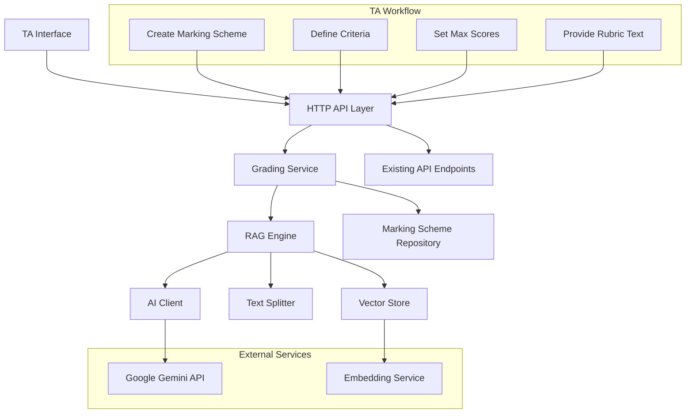

# Design Document

## Overview

The RAG-based essay grading system will be implemented as a Go service that integrates with the existing HTTP server infrastructure. The system follows a modular architecture with clear separation between vector storage, AI integration, and API layers. The design leverages Go's concurrency features for efficient processing while maintaining compatibility with the existing OpenAPI specification.

## TA Workflow and System Integration

### Teaching Assistant Workflow

1. **Marking Scheme Creation**:
   - TA creates a new essay question in the system
   - TA defines the marking scheme with custom criteria (e.g., "Content", "Organization", "Grammar")
   - For each criterion, TA sets:
     - Criterion name and description
     - Maximum score (e.g., 10 points)
     - Optional weighting
   - TA provides rubric text describing performance expectations
   - System processes rubric text into vector embeddings for RAG retrieval

2. **AI-Assisted Grading**:
   - System retrieves student essays and applies RAG grading for each criterion
   - AI provides:
     - Suggested score (e.g., 7/10 for Content)
     - Detailed justification explaining the score
     - Specific text highlights from the essay
     - Constructive improvement suggestions
   - TA reviews AI suggestions and can accept, modify, or override scores

3. **Grade Finalization**:
   - TA makes final decisions on scores
   - System saves both manual scores and AI suggestions for later reinforcement training
   - Final grades are submitted through existing workflow

### Integration with Existing System

The RAG grading system integrates seamlessly with the current API:
- Extends existing `RubricCriteria` model with AI fields
- Populates `aiSuggestedScore`, `highlightedText` fields
- Maintains backward compatibility with manual grading
- Adds new endpoints for marking scheme management

## Architecture

### High-Level Architecture



### Component Responsibilities

- **HTTP API Layer**: Handles incoming requests and integrates with existing endpoints
- **Grading Service**: Orchestrates the grading workflow and manages business logic
- **RAG Engine**: Core retrieval-augmented generation functionality
- **Vector Store**: In-memory vector storage for rubric embeddings
- **Text Splitter**: Chunks rubric text for optimal embedding and retrieval
- **AI Client**: Interfaces with Google Gemini API for grading and embeddings
- **Marking Scheme Repository**: Persists marking schemes and criteria configurations

### New API Endpoints

The following endpoints will be added to support the RAG grading system:

```
POST /marking-schemes
- Create a new marking scheme for an essay question
- Body: MarkingSchemeCreateRequest

GET /marking-schemes/{id}
- Retrieve a specific marking scheme
- Response: MarkingScheme

GET /questions/{questionId}/marking-schemes
- Get all marking schemes for a question
- Response: MarkingScheme[]

POST /students/{studentId}/ai-grade
- Generate AI grades for a student's essay
- Body: AIGradeRequest
- Response: EssayGradingResponse

PUT /students/{studentId}/rubrics/{rubricId}/ai-populate
- Populate AI suggested score for a specific rubric
- Updates existing RubricCriteria with AI fields
```

## Components and Interfaces

### Core Service Interfaces

```go
// RubricChunk represents a piece of rubric text for vector storage
type RubricChunk struct {
    ID       string                 `json:"id"`
    Content  string                 `json:"content"`
    Metadata map[string]interface{} `json:"metadata"`
}

// VectorStore handles embedding storage and similarity search
type VectorStore interface {
    AddDocuments(chunks []RubricChunk) error
    SimilaritySearch(query string, k int) ([]RubricChunk, error)
    Clear() error
}

// AIClient interfaces with Google Gemini API
type AIClient interface {
    GenerateEmbedding(text string) ([]float32, error)
    GradeEssay(essay, context, criterion string, maxScore int) (*AIGradingResult, error)
}

// GradingService orchestrates the RAG grading workflow
type GradingService interface {
    // Marking scheme management
    CreateMarkingScheme(request MarkingSchemeCreateRequest) (*MarkingScheme, error)
    GetMarkingScheme(id string) (*MarkingScheme, error)
    
    // RAG operations
    LoadMarkingSchemeToRAG(schemeID string) error
    
    // Grading operations
    GradeEssayByCriterion(essay, criterionID string) (*AIGradingResult, error)
    GradeEssayAllCriteria(request EssayGradingRequest) (*EssayGradingResponse, error)
    
    // Integration with existing API
    PopulateAISuggestedScores(studentID string, markingSchemeID string) error
}

// MarkingSchemeRepository handles persistence
type MarkingSchemeRepository interface {
    Create(scheme *MarkingScheme) error
    GetByID(id string) (*MarkingScheme, error)
    GetByQuestionID(questionID string) ([]*MarkingScheme, error)
    Update(scheme *MarkingScheme) error
    Delete(id string) error
}
```

### RAG Engine Implementation

The RAG engine implements a three-stage process tailored for criterion-based essay grading:

1. **Ingestion Phase**:
   - TA provides rubric text describing grading expectations
   - System parses rubric to identify criterion-specific sections
   - Text splitter chunks rubric into optimal segments (1000 chars, 100 overlap)
   - Generate embeddings using Google's embedding-001 model
   - Store embeddings in vector database with criterion metadata

2. **Retrieval Phase**:
   - Given a specific criterion (e.g., "Content") and student essay
   - Construct query combining criterion name and essay excerpt
   - Perform similarity search to find most relevant rubric sections
   - Return top 3 most similar chunks with criterion-specific context

3. **Generation Phase**:
   - Use retrieved rubric context with student essay
   - Prompt AI model to evaluate essay against specific criterion
   - Generate structured response with:
     - Numerical score within max score range
     - Detailed justification referencing rubric and essay
     - Highlighted text excerpts supporting the score
     - Constructive improvement suggestions

### Vector Storage Strategy

- **In-Memory Implementation**: Use Go slices with cosine similarity for initial implementation
- **Chunk Size**: 1000 characters with 100 character overlap for optimal retrieval
- **Embedding Model**: Google's embedding-001 model for consistency with Python implementation
- **Search Parameters**: Return top 3 most similar chunks for context

### AI Integration

- **Primary Model**: Google Gemini 1.5 Flash for grading generation
- **Structured Output**: Use JSON schema validation to ensure consistent response format
- **Error Handling**: Implement retry logic and graceful degradation for API failures

#### Prompt Template Structure

```go
const GradingPromptTemplate = `You are an expert AI teaching assistant. Your task is to grade a student's essay based on the provided rubric context.

**STUDENT ESSAY:**
{{.Essay}}

**RUBRIC CONTEXT:**
{{.Context}}

**GRADING INSTRUCTIONS:**
1. Carefully read the student's essay
2. Review the provided rubric context
3. Evaluate the essay specifically for the criterion: **{{.CriterionName}}**
4. Assign a fair score between 0 and {{.MaxScore}}
5. Provide detailed justification and constructive suggestions
6. Identify specific text excerpts that support your evaluation

**RESPONSE FORMAT:**
Return a JSON object with the following structure:
{
  "criterion_id": "{{.CriterionID}}",
  "criterion_name": "{{.CriterionName}}",
  "score": <float between 0 and {{.MaxScore}}>,
  "max_score": {{.MaxScore}},
  "justification": "<detailed explanation>",
  "suggestion_for_improvement": "<constructive feedback>",
  "highlighted_text": "<relevant essay excerpts>",
  "confidence": <float between 0 and 1>
}
`
```

## Data Models

### Data Model Hierarchy

The system follows this hierarchy:
```
Exam → Question → MarkingScheme → Criterion → StudentGrade
```

Each exam has multiple questions. Each question has one marking scheme. Each marking scheme has multiple criteria. Each criterion gets graded for each student.

### Stored vs Calculated Fields

**Stored in Database:**
- Student information (studentID, name, itsc)
- Question details (text, type, number)
- Criterion definitions (name, description, maxScore, weight)
- Individual grades (manualScore, aiSuggestedScore per criterion)
- Answer text and timestamps

**Calculated at Runtime (NOT stored):**
- `totalMarks` for a question (sum of all criteria maxScores)
- `questionTotalScore` (sum of all criterion scores for a question)
- `examTotalScore` (sum of all question scores)
- `percentage` (calculated from totalScore / maxScore * 100)
- `grade` letter (derived from percentage)
- `wordCount` (calculated from answerText)
- Summary statistics (averages, counts, etc.)

These calculated fields are computed on-the-fly when generating API responses to ensure data consistency and avoid redundancy.

### Core Domain Models

```go
// Exam represents an examination
type Exam struct {
    ID        string    `json:"id"`
    CourseID  string    `json:"course_id"`
    Title     string    `json:"title"`
    Year      int       `json:"year"`
    Semester  int       `json:"semester"`
    CreatedBy string    `json:"created_by"`
    CreatedAt time.Time `json:"created_at"`
}

// Question represents a single question in an exam
type Question struct {
    ID             string `json:"id"`
    ExamID         string `json:"exam_id"` // Foreign key to Exam
    QuestionNumber int    `json:"question_number"`
    QuestionText   string `json:"question_text"`
    QuestionType   string `json:"question_type"` // "essay", "multiple_choice", "short_answer"
    TopicID        string `json:"topic_id,omitempty"`
    // Note: TotalMarks is NOT stored - calculated from sum of criteria maxScores
}

// MarkingScheme represents the grading structure for a question
type MarkingScheme struct {
    ID         string      `json:"id"`
    QuestionID string      `json:"question_id"` // Foreign key to Question (1-to-1)
    Criteria   []Criterion `json:"criteria"`
    RubricText string      `json:"rubric_text"` // Original rubric text for RAG
    CreatedBy  string      `json:"created_by"`
    CreatedAt  time.Time   `json:"created_at"`
}

// Criterion represents a single grading criterion within a marking scheme
type Criterion struct {
    ID              string  `json:"id"`
    MarkingSchemeID string  `json:"marking_scheme_id"` // Foreign key to MarkingScheme
    Name            string  `json:"name"`              // e.g., "Content", "Organization"
    Description     string  `json:"description"`
    MaxScore        int     `json:"max_score"`
    Weight          float64 `json:"weight"` // Optional weighting (default 1.0)
}

// Student represents a student in the system
type Student struct {
    StudentID string `json:"student_id"` // Primary identifier - student number (e.g., "20841234")
    Name      string `json:"name"`
    ITSC      string `json:"itsc"`
}

// StudentAnswer represents a student's answer to a question
type StudentAnswer struct {
    ID          string    `json:"id"`
    StudentID   string    `json:"student_id"` // Foreign key to Student
    QuestionID  string    `json:"question_id"` // Foreign key to Question
    AnswerText  string    `json:"answer_text"`
    SubmittedAt time.Time `json:"submitted_at"`
}

// StudentGrade represents the actual grade for a student on a specific criterion
type StudentGrade struct {
    ID               string     `json:"id"`
    StudentAnswerID  string     `json:"student_answer_id"` // Foreign key to StudentAnswer
    CriterionID      string     `json:"criterion_id"`      // Foreign key to Criterion
    ManualScore      *float64   `json:"manual_score"`      // TA's final score
    AISuggestedScore *float64   `json:"ai_suggested_score"`
    HighlightedText  *string    `json:"highlighted_text"`
    AIJustification  *string    `json:"ai_justification"`
    AISuggestion     *string    `json:"ai_suggestion"`
    GradedBy         *string    `json:"graded_by"`
    GradedAt         *time.Time `json:"graded_at"`
}

// AIGradingResult represents the AI's evaluation of a student's essay for one criterion
type AIGradingResult struct {
    CriterionID              string  `json:"criterion_id"`
    CriterionName            string  `json:"criterion_name"`
    Score                    int     `json:"score"`                      // AI suggested score
    MaxScore                 int     `json:"max_score"`
    Justification            string  `json:"justification"`              // Detailed explanation
    SuggestionForImprovement string  `json:"suggestion_for_improvement"` // How to improve
    HighlightedText          *string `json:"highlighted_text"`           // Relevant essay excerpts
    Confidence               float64 `json:"confidence"`                 // AI confidence level (0-1)
}

// EssayGradingRequest represents a request to grade an essay
type EssayGradingRequest struct {
    StudentID      string   `json:"student_id"`
    EssayText      string   `json:"essay_text"`
    MarkingSchemeID string  `json:"marking_scheme_id"`
    CriteriaIDs    []string `json:"criteria_ids"` // Optional: grade specific criteria only
}

// EssayGradingResponse represents the complete AI grading results
type EssayGradingResponse struct {
    StudentID    string            `json:"student_id"`
    Results      []AIGradingResult `json:"results"`
    TotalScore   int               `json:"total_score"`
    MaxTotalScore int              `json:"max_total_score"`
    OverallFeedback string         `json:"overall_feedback"`
    ProcessedAt  time.Time         `json:"processed_at"`
}
```

### Calculation Helper Functions

These functions compute derived values at runtime without storing them in the database:

```go
// CalculateQuestionTotalMarks calculates the total marks for a question
// by summing all criteria maxScores from its marking scheme
func CalculateQuestionTotalMarks(criteria []Criterion) int {
    total := 0
    for _, criterion := range criteria {
        total += criterion.MaxScore
    }
    return total
}

// CalculateQuestionScore calculates a student's total score for a question
// by summing all their criterion grades
func CalculateQuestionScore(grades []StudentGrade) float64 {
    total := 0.0
    for _, grade := range grades {
        if grade.ManualScore != nil {
            total += *grade.ManualScore
        }
    }
    return total
}

// CalculateExamScore calculates a student's total exam score
// by summing all question scores
func CalculateExamScore(questionScores []float64) float64 {
    total := 0.0
    for _, score := range questionScores {
        total += score
    }
    return total
}

// CalculatePercentage calculates percentage score
func CalculatePercentage(score, maxScore float64) float64 {
    if maxScore == 0 {
        return 0
    }
    return (score / maxScore) * 100
}

// CalculateWordCount counts words in answer text
func CalculateWordCount(text string) int {
    words := strings.Fields(text)
    return len(words)
}
```

### API Integration Models

The system will integrate with existing OpenAPI models and extend them for AI grading:

```go
// Extends existing RubricCriteria from OpenAPI spec
type EnhancedRubricCriteria struct {
    ID               string  `json:"id"`
    Title            string  `json:"title"`
    Description      string  `json:"description"`
    Score            float64 `json:"score"`            // Manual score set by TA
    MaxScore         float64 `json:"maxScore"`
    AISuggestedScore float64 `json:"aiSuggestedScore"` // Populated by RAG system
    HighlightedText  *string `json:"highlightedText"`  // AI-identified relevant text
    AIJustification  *string `json:"aiJustification"`  // AI's reasoning for the score
    AISuggestion     *string `json:"aiSuggestion"`     // AI's improvement suggestion
}

// New endpoints to be added to existing API
type MarkingSchemeCreateRequest struct {
    QuestionID   string             `json:"question_id"`
    QuestionType string             `json:"question_type"`
    RubricText   string             `json:"rubric_text"`
    Criteria     []GradingCriterion `json:"criteria"`
}

type AIGradeRequest struct {
    StudentID       string   `json:"student_id"`
    MarkingSchemeID string   `json:"marking_scheme_id"`
    CriteriaIDs     []string `json:"criteria_ids,omitempty"` // Optional: specific criteria
}
```

## Error Handling

### Error Categories

1. **Rubric Processing Errors**: Invalid rubric format, parsing failures
2. **AI Service Errors**: API timeouts, rate limits, invalid responses
3. **Vector Store Errors**: Embedding generation failures, search errors
4. **Integration Errors**: JSON marshaling, HTTP response errors

### Error Response Strategy

```go
type GradingError struct {
    Type    string `json:"type"`
    Message string `json:"message"`
    Details string `json:"details,omitempty"`
}

// Error types
const (
    ErrRubricParsing   = "RUBRIC_PARSING_ERROR"
    ErrAIService      = "AI_SERVICE_ERROR"
    ErrVectorStore    = "VECTOR_STORE_ERROR"
    ErrIntegration    = "INTEGRATION_ERROR"
)
```

### Graceful Degradation

- If AI grading fails, return error but don't block manual grading workflow
- If vector search fails, attempt direct AI grading with full rubric text
- If embedding generation fails, use text-based similarity as fallback

## Testing Strategy

### Unit Testing

- **RAG Engine Components**: Test text splitting, vector operations, similarity search
- **AI Client**: Mock AI responses for consistent testing
- **Rubric Parser**: Test various rubric formats and edge cases
- **Grading Service**: Test end-to-end grading workflows

### Integration Testing

- **API Endpoints**: Test integration with existing HTTP handlers
- **AI Service Integration**: Test with real AI API (rate-limited)
- **Error Scenarios**: Test failure modes and recovery mechanisms

### Performance Testing

- **Concurrent Grading**: Test multiple simultaneous grading requests
- **Large Rubrics**: Test with complex, multi-criteria rubrics
- **Memory Usage**: Monitor vector store memory consumption
- **Response Times**: Ensure < 2 second response time per criterion

### Test Data Strategy

```go
// Test rubric for consistent testing
const TestRubric = `
**Argument & Thesis (Max 10 points)**
- Excellent (9-10 pts): Clear, insightful, arguable thesis with strong support
- Good (7-8 pts): Clear thesis with adequate support
- Needs Improvement (4-6 pts): Unclear or weak thesis
- Inadequate (0-3 pts): No clear thesis

**Use of Evidence (Max 5 points)**
- Excellent (5 pts): Specific, well-integrated evidence with analysis
- Good (3-4 pts): Relevant evidence with some analysis
- Needs Improvement (1-2 pts): Weak or poorly explained evidence
`

// Test essays covering different performance levels
var TestEssays = map[string]string{
    "excellent": "...",
    "good":      "...",
    "poor":      "...",
}
```

## Implementation Phases

### Phase 1: Core RAG Engine
- Implement text splitting and vector storage
- Create AI client with embedding and grading capabilities
- Build basic retrieval and generation pipeline

### Phase 2: Rubric Processing
- Implement rubric parser for structured criteria extraction
- Add support for different rubric formats
- Create criterion-specific grading workflows

### Phase 3: API Integration
- Integrate with existing HTTP server and endpoints
- Implement AI score population in existing data structures
- Add new endpoints for rubric management and batch grading

### Phase 4: Performance & Production
- Optimize vector operations and memory usage
- Add comprehensive error handling and logging
- Implement monitoring and metrics collection